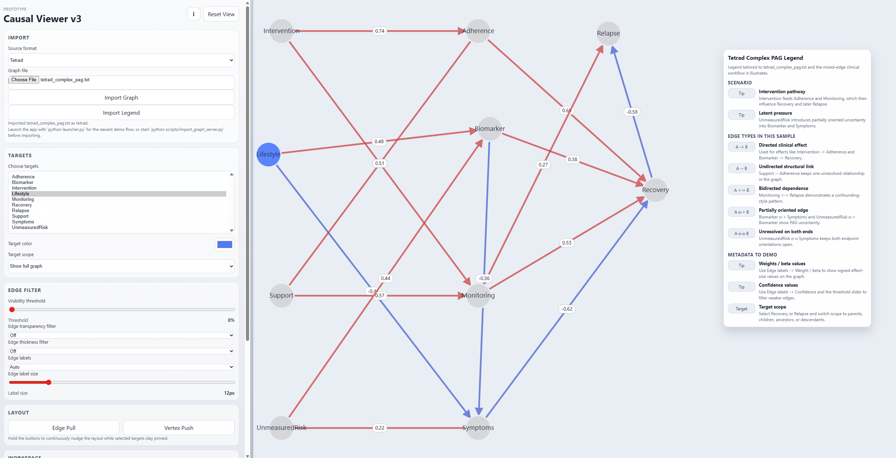
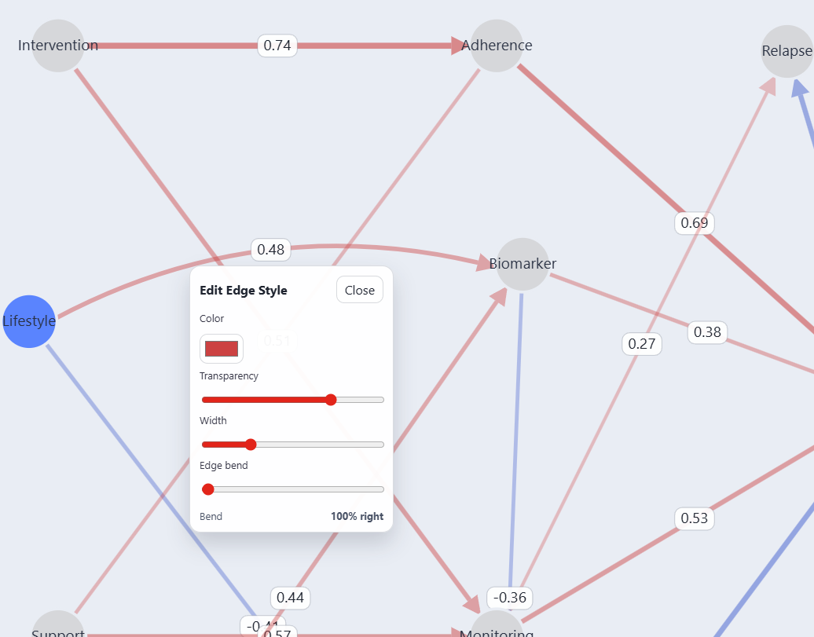

# Causal Graph Visualizer

This project aims to be a causal graph viewer for importing graphs from different tools, exploring them in one interface, and exporting clean figures for presentations or papers. It uses a browser-based viewer plus a small local Python service that converts each supported graph format into the same structure before display.

Supported imports:

- Tetrad
- causal-learn
- DoWhy
- Dagitty
- Canonical JSON

What the app can do:

- import graphs from several source formats
- zoom, pan, and drag nodes
- filter around selected targets
- show neighbors, parents, children, ancestors, or descendants
- edit node and edge appearance in the viewer
- save sessions and export layout JSON
- export final figures as `PNG`, `JPEG`, `WebP`, or `SVG`

The current viewer entry point is [Causal viewer_v3/index.html](./Causal%20viewer_v3/index.html).

**Running The Beta**
This repo is currently set up as a source-based beta. That means Python is required to run it.

Open PowerShell in the repo root and run:

```powershell
$env:PYTHONPATH='.'
python .\launcher.py
```

This starts the local import server and opens the viewer in our default browser.

If you want to start the import server by itself, run:

```powershell
$env:PYTHONPATH='.'
python .\scripts\import_graph_server.py
```

Then open [Causal viewer_v3/index.html](./Causal%20viewer_v3/index.html) in your browser.

**Sample Files**
Sample files are in [sample v3 inputs](./sample%20v3%20inputs).

A good file to try first:


- `causal_learn_complex_pag.txt`


Basic flow:

1. Start the app with `python .\launcher.py`.
2. In the viewer, pick a source format.
3. Choose a matching graph file.
4. Click `Import Graph`.
5. Optionally load the matching legend.
6. Explore, edit, and export the graph.

**Screenshots**
Main workspace with the sidebar controls, loaded complex sample graph, and legend panel:



Edge styling editor opened on a graph edge:



**Development Notes**
- The viewer starts empty until a graph is imported.
- Import and legend loading depend on the local Python server.
- Browser settings such as threshold, label mode, edge filter modes, target color, and sidebar width are saved locally.
- Session save/load and layout export are available from the viewer UI.
